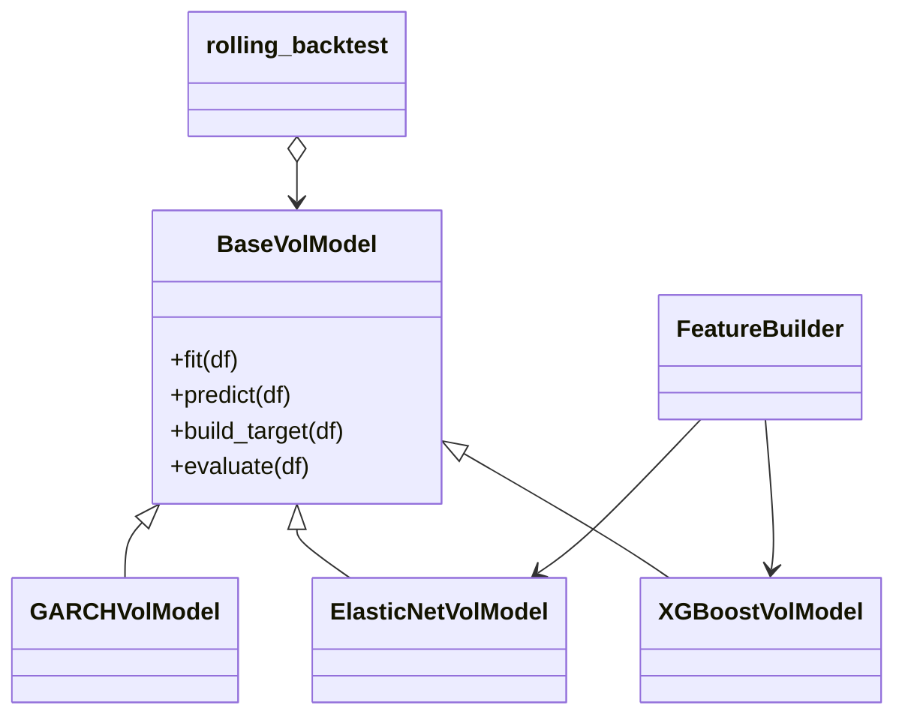

# 03 Code Reference and Architecture Overview

This document provides a high-level overview of the main modules, classes, and methods used in the volatility forecasting project.
It complements the docstrings included directly in the code by describing:

- model architecture,
- module interactions,
- expected inputs/outputs for key methods,
- and usage examples.

---

## 1. Project Architecture

The project is organized into the following main components:

```text
src/volforecast/
    data/              # (to be developed)
    features/          # Feature engineering (lags, VIX, calendar)
    models/            # GARCH, ElasticNet, XGBoost volatility models
    evaluation/        # Metrics and backtesting
    visualization/     # Plotting utilities
```

The modules interact in a pipeline:

- **Data** → **Feature Builder** → **Model.fit** → **Model.predict** → **Evaluation** / **Plots**

The architecture is shown below.

---

### 1.1. Architecture Diagram

```mermaid
flowchart TD

    A[Raw DataFrame<br>(returns, VIX, timestamp)] --> B[FeatureBuilder<br>(lags, dummies)]
    B --> C1[ElasticNetVolModel]
    B --> C2[XGBoostVolModel]
    A --> C3[GARCHVolModel]

    C1 --> D[rolling_backtest]
    C2 --> D
    C3 --> D

    D --> E[Metrics<br>RMSE / MAE / QLIKE]
    D --> F[Predictions & Targets]

    F --> G[Visualization<br>plot.py]
```

---

## 2. Base Framework

All models inherit from:

#### `BaseVolModel`

Located in: `src/volforecast/models/base.py`

This abstract class defines the unified interface for every model.

---

### 2.1. Core Methods

#### **`fit(df)`**

Estimates the model on the provided training window.
Input: `pd.DataFrame` with at least a return column
Output: fitted model instance

#### **`predict(df)`**

Produces volatility forecasts aligned with the index of `df`.
Output: `pd.Series` named `"y_pred"`

#### **`build_target(df)`**

Computes realized variance:

$$y_t = r_{t+1}^2$$

#### **`evaluate(df)`**

Applies RMSE, MAE, and QLIKE on predictions vs. targets.

---

### 2.2. Example Usage

```python
from volforecast.models.base import BaseConfig
from volforecast.models.elasticnet_regression_model import ElasticNetVolModel
from volforecast.features.builders import FeatureBuilder

cfg = BaseConfig(return_col="log_return_AAPL")
builder = FeatureBuilder()
model = ElasticNetVolModel(cfg, builder)

model.fit(train_df)
pred = model.predict(test_df)
metrics = model.evaluate(test_df)
```

---

## 3. Feature Engineering

#### **Module:** `src/volforecast/features/builders.py`

#### **Class: `FeatureBuilder`**

Responsible for constructing all ML features:

- lagged returns: `lag_returns_L`
- lagged VIX: `lag_vix_L`
- day-of-week dummy variables

---

### 3.1. Core Method

#### **`build_features(df)`**

Returns DataFrame `X` aligned with `df.index`.

---

### 3.2. Example

```python
builder = FeatureBuilder(lags_returns=(1,2), lags_vix=(1,2))
X = builder.build_features(df)
print(X.head())
```

---

## 4. GARCH Volatility Model

#### **Module:** `src/volforecast/models/garch_model.py`

#### **Class:** `GARCHVolModel`

Implements classical GARCH-type models using the `arch` library.

---

### 4.1. Key Characteristics

- Uses only the return series (no external regressors)
- Supports:

  - GARCH(p,q)
  - GJR asymmetry (`o > 0`)
  - multiple distributions (`normal`, `t`, `skewt`, `ged`, …)
  - mean specifications (`zero`, `constant`, `AR`, `HAR`)

---

### 4.2. Core Methods

#### **`fit(df)`**

Fits GARCH(p,q) using maximum likelihood.

#### **`predict(df)`**

Returns one-step-ahead conditional variance forecasts.

---

### 4.3. Example

```python
from volforecast.models.garch_model import GARCHVolModel, GARCHConfig

cfg = GARCHConfig(p=1, q=1, dist="t")
model = GARCHVolModel(cfg)

model.fit(train_df)
pred = model.predict(test_df)
```

---

## 5. ElasticNet Regression Model

#### **Module:** `src/volforecast/models/elasticnet_regression_model.py`

#### **Class:** `ElasticNetVolModel`

Penalized linear regression on lagged features constructed by `FeatureBuilder`.

---

### 5.1. Key Characteristics

- Uses ElasticNetCV for cross-validated estimation
- Supports:

  - log-target transformation
  - feature scaling
  - custom grid of `alpha` and `l1_ratio`

---

### 5.2. Core Methods

#### **`fit(df)`**

Fits a pipeline with:

```
StandardScaler (optional)
ElasticNetCV
```

#### **`predict(df)`**

Predicts variance, inverting the log-target if used.

---

### 5.3. Example

```python
cfg = ElasticNetConfig()
builder = FeatureBuilder()
model = ElasticNetVolModel(cfg, builder)

model.fit(train_df)
pred = model.predict(test_df)
```

---

## 6. XGBoost Regression Model

#### **Module:** `src/volforecast/models/xgboost_model.py`

#### **Class:** `XGBoostVolModel`

Gradient-boosted tree model for nonlinear volatility forecasting.

---

### 6.1. Key Characteristics

- Uses the same features as ElasticNet
- Supports log-target transform
- Hyperparameters:

  - `n_estimators`
  - `learning_rate`
  - `max_depth`
  - `subsample`
  - `colsample_bytree`

(Future extension: randomized CV)

---

### 6.2. Core Methods

#### **`fit(df)`**

Fits an `XGBRegressor` on lagged features.

#### **`predict(df)`**

Generates predictions aligned with `df.index`, applying inverse-log if needed.

---

### 6.3. Example

```python
cfg = XGBoostConfig()
builder = FeatureBuilder()
model = XGBoostVolModel(cfg, builder)

model.fit(train_df)
pred = model.predict(test_df)
```

---

## 7. Backtesting and Evaluation

#### **Module:** `src/volforecast/evaluation/backtest.py`

#### **Function:** `rolling_backtest`

Provides a walk-forward evaluation consistent with financial applications.

---

### 7.1. Behavior

At each step:

1. Fit model on history up to `current_end`
2. Predict at the next available timestamp
3. Store `y_pred` and `y_true`
4. Advance the window

Supports:

- expanding windows
- fixed-size windows
- time-aware stepping (`"1B"`, `"1D"`, etc.)

---

### 7.2. Example

```python
from volforecast.evaluation.backtest import rolling_backtest

res = rolling_backtest(
    model,
    df,
    train_start=df.index[0],
    train_end=df.index[250],
    step="1B",
)
print(res["metrics"])
```

---

## 8. Metrics

#### **Module:** `src/volforecast/evaluation/metrics.py`

Implements:

- RMSE
- MAE
- QLIKE (quasi-likelihood loss)

All metrics operate on:

```python
pd.Series(y_true), pd.Series(y_pred)
```

---

## 9. Putting It All Together

Below is a minimal end-to-end example:

```python
from volforecast.models.elasticnet_regression_model import ElasticNetVolModel, ElasticNetConfig
from volforecast.features.builders import FeatureBuilder
from volforecast.evaluation.backtest import rolling_backtest

cfg = ElasticNetConfig()
builder = FeatureBuilder()
model = ElasticNetVolModel(cfg, builder)

result = rolling_backtest(
    model,
    df,
    train_start=df.index[0],
    train_end=df.index[250],
    step="1B",
)

print(result["metrics"])
```

---

## 10. Summary Diagram


